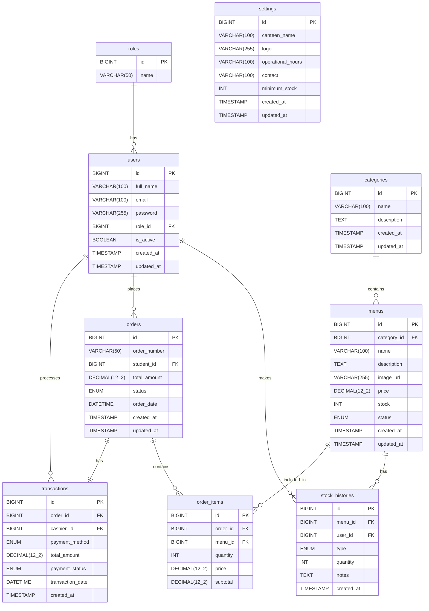

# PRD ERD

# Kantin Cermat Dubes

## Entity Relationship Diagram (ERD)

### Versi

1.0

### Database

MySQL 8

---

# 1. Tujuan

ERD Kantin Cermat Dubes digunakan sebagai dasar pembangunan:

* Backend NestJS
* Prisma ORM
* REST API
* Website Admin
* Aplikasi Android Siswa

ERD dirancang agar:

* Mudah dikembangkan
* Mudah dipelihara
* Mendukung transaksi kantin
* Mendukung pre-order siswa
* Mendukung laporan penjualan

---

# 2. Daftar Entitas

## users

Menyimpan akun pengguna sistem.

### Field

| Field      | Type         |
| ---------- | ------------ |
| id         | BIGINT       |
| full_name  | VARCHAR(100) |
| email      | VARCHAR(100) |
| password   | VARCHAR(255) |
| role_id    | BIGINT       |
| is_active  | BOOLEAN      |
| created_at | TIMESTAMP    |
| updated_at | TIMESTAMP    |

---

## roles

Menyimpan role pengguna.

### Field

| Field | Type        |
| ----- | ----------- |
| id    | BIGINT      |
| name  | VARCHAR(50) |

### Data Awal

* Admin
* Kasir
* Siswa

---

## categories

Kategori menu.

### Field

| Field       | Type         |
| ----------- | ------------ |
| id          | BIGINT       |
| name        | VARCHAR(100) |
| description | TEXT         |
| created_at  | TIMESTAMP    |
| updated_at  | TIMESTAMP    |

---

## menus

Data makanan dan minuman.

### Field

| Field       | Type          |
| ----------- | ------------- |
| id          | BIGINT        |
| category_id | BIGINT        |
| name        | VARCHAR(100)  |
| description | TEXT          |
| image_url   | VARCHAR(255)  |
| price       | DECIMAL(12,2) |
| stock       | INT           |
| status      | ENUM          |
| created_at  | TIMESTAMP     |
| updated_at  | TIMESTAMP     |

### Status

* available
* unavailable

---

## stock_histories

Riwayat perubahan stok.

### Field

| Field      | Type      |
| ---------- | --------- |
| id         | BIGINT    |
| menu_id    | BIGINT    |
| user_id    | BIGINT    |
| type       | ENUM      |
| quantity   | INT       |
| notes      | TEXT      |
| created_at | TIMESTAMP |

### Type

* IN
* OUT
* ADJUSTMENT

---

## orders

Header pesanan siswa.

### Field

| Field        | Type          |
| ------------ | ------------- |
| id           | BIGINT        |
| order_number | VARCHAR(50)   |
| student_id   | BIGINT        |
| total_amount | DECIMAL(12,2) |
| status       | ENUM          |
| order_date   | DATETIME      |
| created_at   | TIMESTAMP     |
| updated_at   | TIMESTAMP     |

### Status

* pending
* processing
* ready
* completed
* cancelled

---

## order_items

Detail pesanan.

### Field

| Field    | Type          |
| -------- | ------------- |
| id       | BIGINT        |
| order_id | BIGINT        |
| menu_id  | BIGINT        |
| quantity | INT           |
| price    | DECIMAL(12,2) |
| subtotal | DECIMAL(12,2) |

---

## transactions

Data pembayaran.

### Field

| Field            | Type          |
| ---------------- | ------------- |
| id               | BIGINT        |
| order_id         | BIGINT        |
| cashier_id       | BIGINT        |
| payment_method   | ENUM          |
| total_amount     | DECIMAL(12,2) |
| payment_status   | ENUM          |
| transaction_date | DATETIME      |
| created_at       | TIMESTAMP     |

### Payment Method

* cash
* qris

### Payment Status

* unpaid
* paid
* refunded

---

## settings

Konfigurasi sistem.

### Field

| Field             | Type         |
| ----------------- | ------------ |
| id                | BIGINT       |
| canteen_name      | VARCHAR(100) |
| logo              | VARCHAR(255) |
| operational_hours | VARCHAR(100) |
| contact           | VARCHAR(100) |
| minimum_stock     | INT          |
| created_at        | TIMESTAMP    |
| updated_at        | TIMESTAMP    |

---

# 3. Relasi Antar Tabel

## Role → User

roles (1)
↓
users (N)

Satu role dapat dimiliki banyak pengguna.

---

## Category → Menu

categories (1)
↓
menus (N)

Satu kategori memiliki banyak menu.

---

## Menu → Stock History

menus (1)
↓
stock_histories (N)

Satu menu memiliki banyak riwayat stok.

---

## User → Stock History

users (1)
↓
stock_histories (N)

Satu pengguna dapat melakukan banyak perubahan stok.

---

## User (Siswa) → Order

users (1)
↓
orders (N)

Satu siswa dapat membuat banyak pesanan.

---

## Order → Order Item

orders (1)
↓
order_items (N)

Satu pesanan memiliki banyak item.

---

## Menu → Order Item

menus (1)
↓
order_items (N)

Satu menu dapat muncul di banyak pesanan.

---

## Order → Transaction

orders (1)
↓
transactions (1)

Satu pesanan memiliki satu transaksi pembayaran.

---

## User (Kasir) → Transaction

users (1)
↓
transactions (N)

Satu kasir dapat memproses banyak transaksi.

---

# 4. ERD Diagram

roles
|
└── users
|
├── orders
│   └── order_items
│        └── menus
│             └── categories
│
├── stock_histories
│        └── menus
│
└── transactions
└── orders

---

# 5. Business Rules

### Menu

* Menu harus memiliki kategori.
* Harga tidak boleh kurang dari 0.
* Stok tidak boleh bernilai negatif.

### Pesanan

* Pesanan minimal memiliki 1 item.
* Pesanan dapat dibatalkan sebelum diproses.

### Transaksi

* Transaksi hanya dibuat jika terdapat pesanan.
* Status pembayaran harus tercatat.

### Stok

* Stok otomatis berkurang setelah transaksi berhasil.
* Seluruh perubahan stok wajib masuk ke stock_histories.

---

# 6. Estimasi Jumlah Tabel

| Tabel           | Fungsi            |
| --------------- | ----------------- |
| roles           | Role pengguna     |
| users           | Pengguna sistem   |
| categories      | Kategori menu     |
| menus           | Data menu         |
| stock_histories | Riwayat stok      |
| orders          | Pesanan           |
| order_items     | Detail pesanan    |
| transactions    | Pembayaran        |
| settings        | Pengaturan sistem |

Total: 9 Tabel

---

# 7. Scope Versi 1.0

Fitur yang didukung:

✅ Login & Role Management

✅ Manajemen Menu

✅ Manajemen Kategori

✅ Manajemen Stok

✅ Pre-Order Siswa

✅ POS Kasir

✅ Transaksi Pembayaran

✅ Dashboard

✅ Laporan Penjualan

✅ Pengaturan Sistem

Database siap digunakan untuk Backend NestJS, Prisma ORM, Website Admin React, dan Aplikasi Android Kantin Cermat Dubes.

# Kantin Cermat Dubes - Entity Relationship Diagram

Below is the Entity Relationship Diagram (ERD) based on the database structure defined in `docs/ERD.md`.

